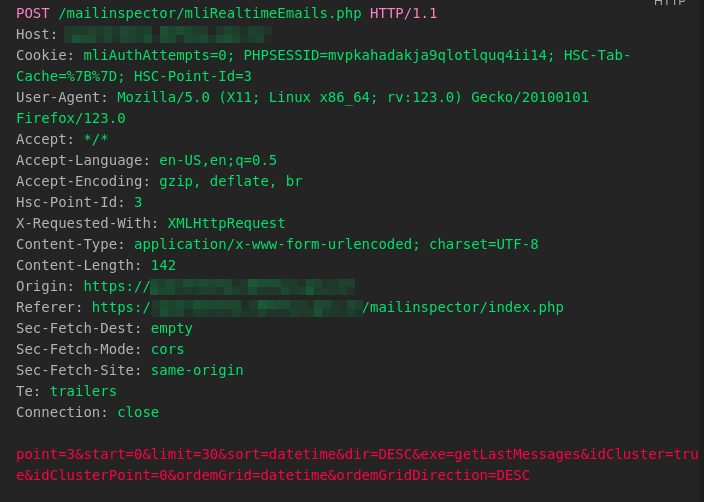

# CVE-2024-34472

**Description:**  An authenticated user can abuse Blind SQL injection vulnerability exists in the `mliRealtimeEmails.php` file. The `ordemGrid` parameter in a POST request to `/mailinspector/mliRealtimeEmails.php` does not Properly sanitize input, allowing an authenticated attacker to execute arbitrary SQL commands, leading to the potential disclosure of the entire application database.

**Versions:** Discovered in HSC Mailinspector 5.2.17-3 but applicable to all versions up to 5.2.18.

## Proof of Concept

While navigating through the email inbox, a POST request to `/mailinspector/mliRealtimeEmails.php` was detected, passing the following parameters:

> POST Payload: `point=3&start=0&limit=30&sort=datetime&dir=DESC&exe=getLastMessages&idCluster=true&idClusterPoint=0&ordemGrid=<SQL INJECTION HERE>&ordemGridDirection=DESC`

The parameter `ordemGrid` doesn't seem to handle the data inserted into it properly, allowing SQL code to be interpreted when passed through it.

